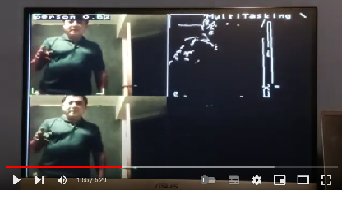
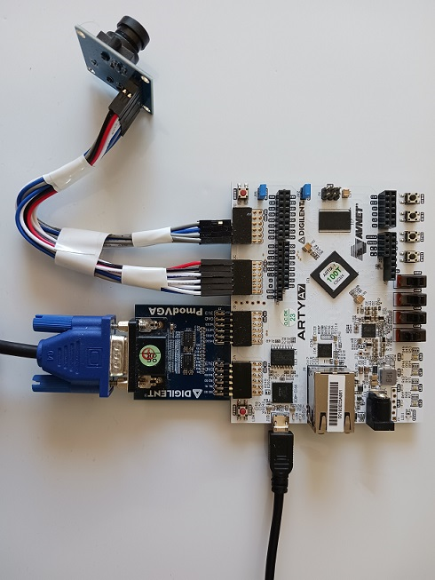
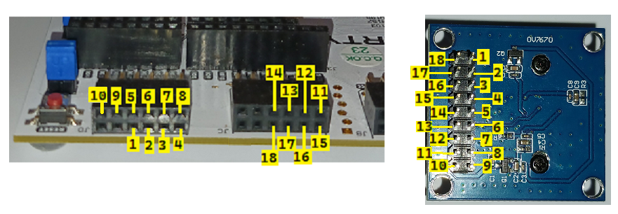

# Introduction

ztachip is a RISCV accelerator for vision and AI edge applications running on low-end FPGA devices
or custom ASIC.

Acceleration provided by ztachip can be up to 20-50x compared with a non-accelerated RISCV implementation
on many vision/AI tasks. ztachip performs also better when compared with a RISCV that is equipped with
vector extension.

An innovative tensor processor hardware is implemented to accelerate a wide range of different tasks from
many common vision tasks such as edge-detection, optical-flow, motion-detection, color-conversion
to executing TensorFlow AI models. This is one key difference of ztachip when compared with other accelerators
that tend to accelerate only a narrow range of applications only (for example convolution neural network only).

A new tensor programming paradigm is introduced to allow programmers to leverage the
massive processing/data parallelism enabled by ztachip tensor processor.

This is first release so documentation is still very lacking. Please visit this site later for more information including hardware architecture description and programmers's guide.

[](https://www.youtube.com/watch?v=amubm828YGs)


# Code structure

- [SW/compiler](SW/compiler): compiler to generate instructions for the tensor processor.

- [SW/apps](SW/apps): vision and AI stack implementation. Many prebuilt acceleration functions are provided to provide
programmers with a fast path to leverage ztachip acceleration.
This folder is also a good place to learn on how to program your own custom acceleration functions.

- [SW/base](SW/base): SW framework library and some utilities

- [SW/fs](SW/fs): read-only file system to be downloaded together with the build image.

- [SW/src](SW/src): codes for the reference design example. This is a good place to learn on how to use ztachip
prebuilt vision and AI stack.

- [HW/examples](HW/examples): HDL codes for the reference design.

- [HW/examples/GHRD/MyVexRiscv.scala](HW/examples/GHRD/MyVexRiscv.scala): RISCV core used in this example is based on VexRiscv implementation. This file is used by [VexRiscv project](https://github.com/SpinalHDL/VexRiscv) to generate the Riscv core.

- [HW/platform](HW/platform): This is a thin wrapper layer to help ztachip to be synthesized efficiently
on different FPGA or ASIC. Choose the appropriate sub-folder that corresponds to your FPGA target.
A generic implementation is also provided for simulation environment. Any FPGA/ASIC can be supported
with the appropriate implementation of this wrapper layer.

- [HW/src](HW/src): main ztachip HDL source codes.

# Build procedure

## Prerequisites (Ubuntu)

```
sudo apt-get install autoconf automake autotools-dev curl python3 libmpc-dev libmpfr-dev libgmp-dev gawk build-essential bison flex texinfo gperf libtool patchutils bc zlib1g-dev libexpat-dev python3-pip
pip3 install numpy
```

## Download and build RISCV tool chain

The build below is a pretty long.

```
export PATH=/opt/riscv/bin:$PATH
git clone https://github.com/riscv/riscv-gnu-toolchain
cd riscv-gnu-toolchain
./configure --prefix=/opt/riscv --with-arch=rv32im --with-abi=ilp32
sudo make
```

## Download and build ztachip

```
git clone https://github.com/ztachip/ztachip.git
export PATH=/opt/riscv/bin:$PATH
cd ztachip
cd SW/compiler
make clean all
cd ../fs
python3 bin2c.py
cd ..
make clean all -f makefile.kernels
make clean all
```

## Build FPGA

- Download Xilinx Vivado Webpack free edition.

- With Vivado, open project ztachip/HW/examples/GHRD/GHRD.xpr

- The target board used in this example is the [ArtyA7-100T](https://digilent.com/shop/arty-a7-artix-7-fpga-development-board/)

- Build FPGA image and program it to flash as described in
[Vivado User Guide](Documentation/Vivado.md)

# Run reference design example

The following demos are demonstrated on the [ArtyA7-100T FPGA development board](https://digilent.com/shop/arty-a7-artix-7-fpga-development-board/).

- Image classification with TensorFlow's Mobinet

- Object detection with TensorFlow's SSD-Mobinet

- Edge detection using Canny algorithm

- Point-of-interest using Harris-Corner algorithm

- Motion detection

- Multi-tasking with ObjectDetection, edge detection, Harris-Corner, Motion Detection running at
same time

To run the demo, press button0 to switch between different AI/vision applications.

## Preparing hardware

Reference design example required the hardware components below... 

- [Arty A7-100T development board](https://digilent.com/shop/arty-a7-artix-7-fpga-development-board/)

- [VGA module](https://digilent.com/shop/pmod-vga-video-graphics-array/)

- [Camera module](https://www.amazon.ca/640X480-Interface-Exposure-Control-Display/dp/B07PX4N3YS/ref=sr_1_2_sspa?gclid=EAIaIQobChMIttra8bjo-QIVCMqzCh27tA5XEAAYASAAEgKJTPD_BwE&hvadid=596026577980&hvdev=c&hvlocphy=9000555&hvnetw=g&hvqmt=e&hvrand=6338354247560979516&hvtargid=kwd-296249713094&hydadcr=13589_13421122&keywords=ov7670+camera+module&qid=1661652319&sr=8-2-spons&psc=1&spLa=ZW5jcnlwdGVkUXVhbGlmaWVyPUEzVDhCRUlYWEJZUU8xJmVuY3J5cHRlZElkPUEwMDExNDE5M1ZRSEw3WDdEWk9VWiZlbmNyeXB0ZWRBZElkPUEwMTgwOTYwWTFXWUNPWE8xQzk2JndpZGdldE5hbWU9c3BfYXRmJmFjdGlvbj1jbGlja1JlZGlyZWN0JmRvTm90TG9nQ2xpY2s9dHJ1ZQ==)

Attach the VGA and Camera modules to Arty-A7 board according to picture below 



Connect camera_module to Arty board according to picture below



## Download and build OpenOCD package required for GDB debugger's JTAG connectivity

In this example, we will load the program using GDB debugger and JTAG

```
sudo apt-get install libtool automake libusb-1.0.0-dev texinfo libusb-dev libyaml-dev pkg-config
git clone https://github.com/SpinalHDL/openocd_riscv
cd openocd_riscv
./bootstrap
./configure --enable-ftdi --enable-dummy
make
cp <ztachip installation folder>/tools/openocd/soc_init.cfg .
cp <ztachip installation folder>/tools/openocd/usb_connect.cfg .
cp <ztachip installation folder>/tools/openocd/xilinx-xc7.cfg .
cp <ztachip installation folder>/tools/openocd/jtagspi.cfg .
cp <ztachip installation folder>/tools/openocd/cpu0.yaml .
```

## Launch OpenOCD

Launch OpenOCD to provide JTAG connectivity for GDB debugger

```
cd <openocd_riscv installation folder>
sudo src/openocd -f usb_connect.cfg -c 'set MURAX_CPU0_YAML cpu0.yaml' -f soc_init.cfg
```

## Launch GDB debugger

Open another terminal, then launch GDB debugger

```
export PATH=/opt/riscv/bin:$PATH
cd <ztachip installation folder>/SW/src
riscv32-unknown-elf-gdb ../build/ztachip.elf
```

## Load program to DRAM memory using GDB debugger

From GDB debugger prompt, issue the commands below

```
target remote localhost:3333
set remotetimeout 60
set arch riscv:rv32
monitor reset halt
load
```

## Run the program

After sucessfully loading the program, issue command below at GDB prompt

```
continue
```

Press button0 to switch between different AI/vision applications.


# How to port ztachip to other FPGA,ASIC and SOC 

Click [here](Documentation/PortProcedure.md) for procedure on how to port ztachip and its applications to other FPGA/ASIC and SOC.

# Further reading

[Technical overview](Documentation/Overview.md)

[Hardware Architecture](Documentation/HardwareDesign.md)

[Programmers guide](Documentation/ztachip_programmer_guide.pdf)

# Contact

This project is free to use. But for business consulting and support, please contact vuongdnguyen@hotmail.com

Follow ztachip on Twitter: https://twitter.com/ztachip 

